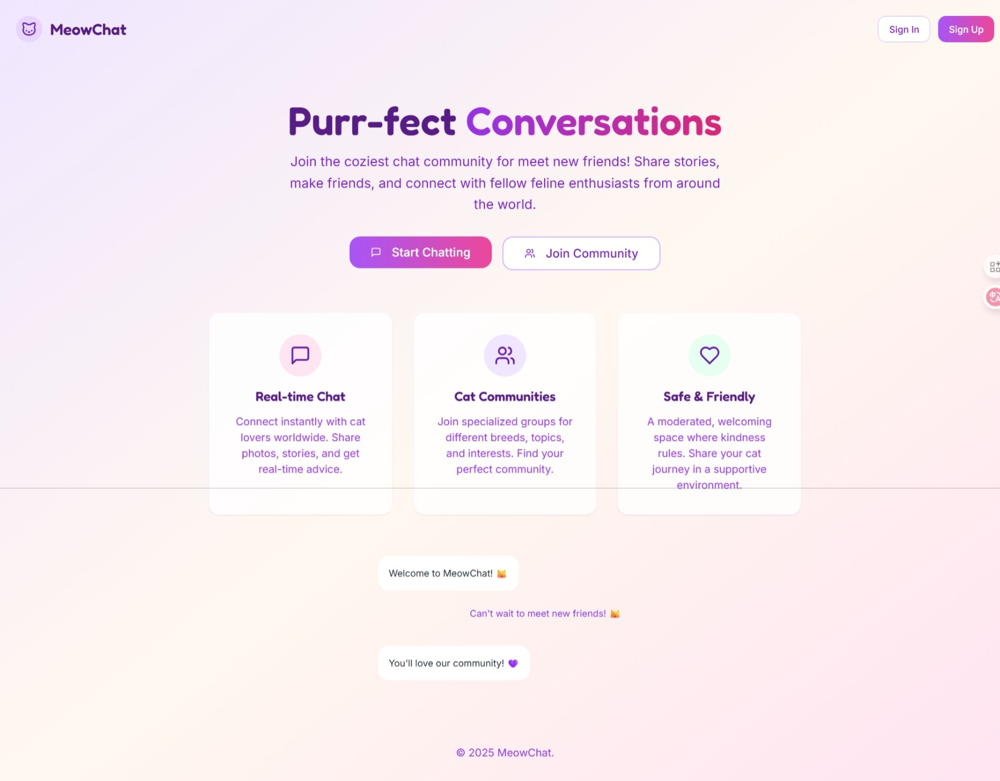
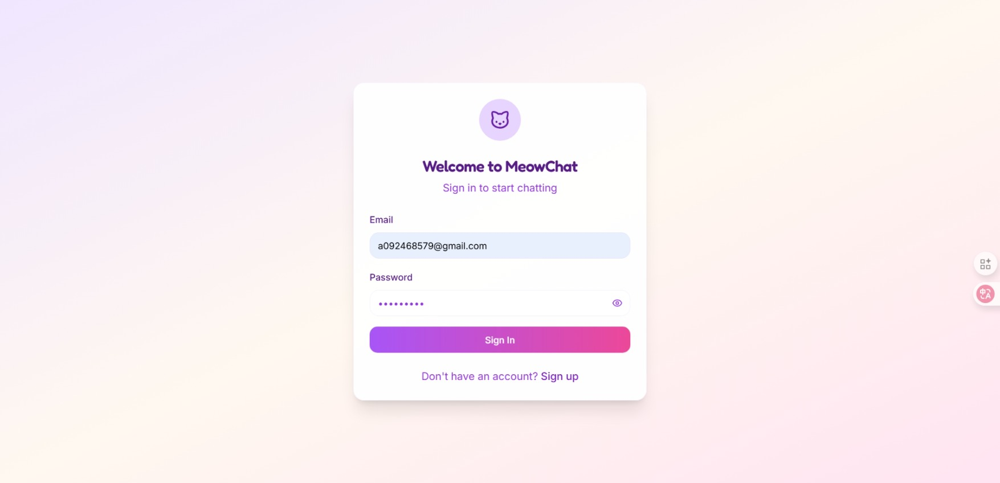
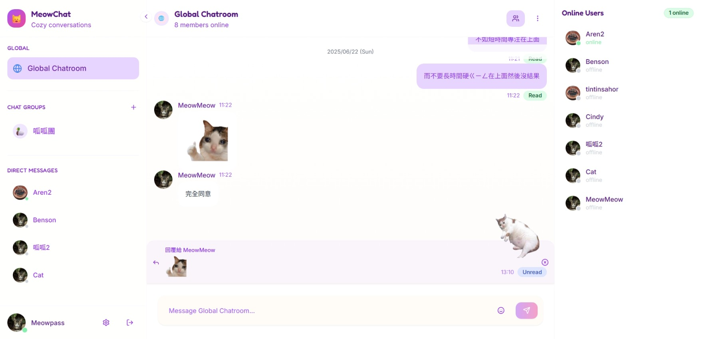
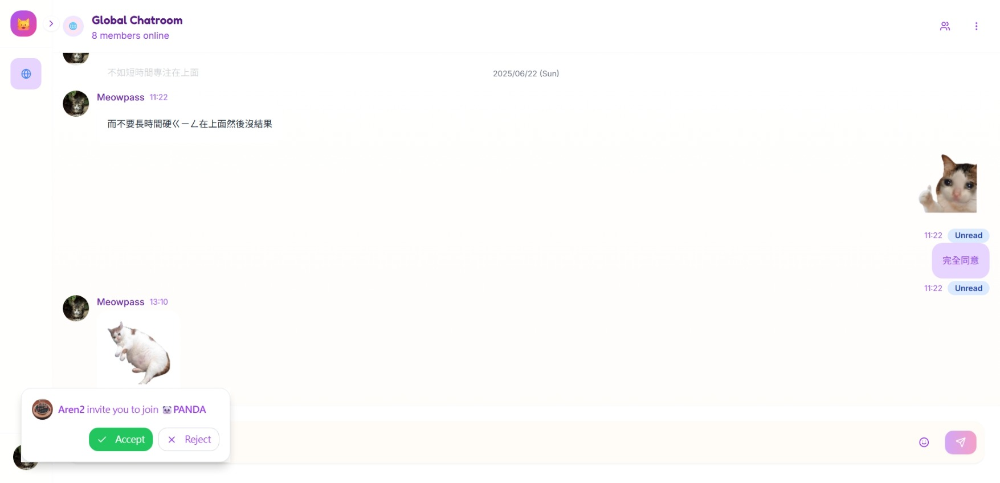
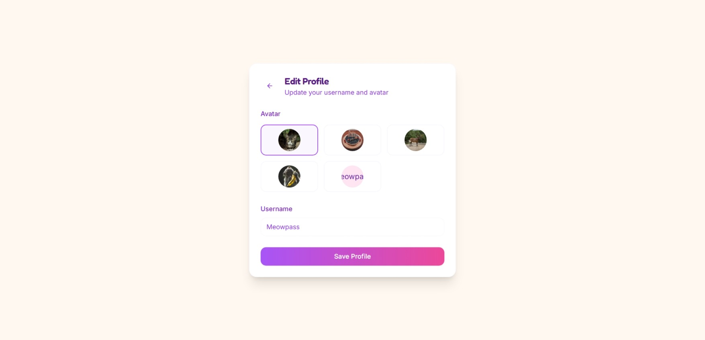

# 🐱MeowChat 聊天室（MERN Stack）

MeowChat 是一個線上多人聊天室，支援群組聊天、私聊、即時邀請與訊息未讀狀態管理，並以 MERN（MongoDB、Express.js、React.js、Node.js）為技術基礎打造。

---

## 目錄

- [技術](#技術)
- [功能特色](#功能特色)
- [專案結構](#專案結構)
- [專案畫面截圖](#專案畫面截圖)
- [LiveSite](#livesite)
- [作者資訊](#作者資訊)

---

## 技術

**Frontend**  
- React + Vite  
- Zustand 狀態管理  
- TailwindCSS + Shadcn/ui  
- Socket.IO Client  

**Backend**  
- Node.js + Express.js  
- MongoDB (Mongoose ODM)  
- Socket.IO Server  
- RESTful API 設計  

---

## 功能特色

### 使用者功能
- 使用者登入與即時身份辨識
- 狀態變更（上線、離開、離線）同步顯示
- 私聊聊天室自動建立與更新

### 群組功能
- 建立群組、邀請成員即時加入
- 可自訂聊天室名稱與頭貼
- 未讀訊息與已讀回報機制
- 邀請通知可接受/拒絕並顯示自訂toast

### 訊息系統
- 支援即時聊天與訊息同步
- 伺服器儲存與快取處理
- 更新訊息、更新已讀、訊息接收與回覆訊息

---

## 專案結構

```
MeowChat/
├── server/
│ ├── controllers/
│ ├── models/
│ ├── routes/
│ ├── socket/
│ ├── server.js
│ └── package.json
│
├── client/
│ ├── src/
│ │ ├── lib/
│ │ ├── components/
│ │ ├── hooks/
│ │ ├── pages/
│ │ ├── stores/
│ │ ├── types/
│ │ ├── utils/
│ │ └── main.tsx
│ │
│ ├── tailwind.config.js
│ └── package.json
│
└── README.md
```
---

## 專案畫面截圖

- 首頁


- 登入頁面


- 聊天室頁面


- 即時邀請與通知 Toast


- 使用者設定


---

## LiveSite

- GitHub Repo: [MeowChat](https://github.com/Benson0721/MeowChat_vercel)
- Live Demo: [MeowChat on Vercel](https://meow-chat-vercel.vercel.app)

---

## 作者資訊

- 作者：Benson
- 前端學習者-以成為一名前端工程師為目標!
- 作品集：[Benson's Portfolio](https://www.notion.so/Front-End-layout-Portfolio-1c4acba779c38053a9dcf4b1caa7af0c)
- Email：a092468579@gmail.com

---

> 本專案仍持續優化中，歡迎給予建議與指教 🙌